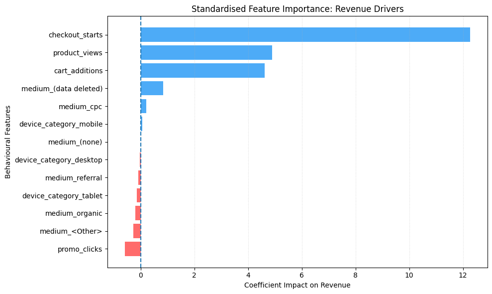

# GA4 Ecommerce Revenue Drivers Analysis

## Project Overview

This project explores which user behaviours are most strongly associated with ecommerce revenue using the **GA4 Obfuscated Sample Ecommerce Dataset**.

The dataset is provided by Google and **emulates a web ecommerce implementation**, replicating the event structure typically captured in real-world Google Analytics 4 tracking.

The goal of this project is to identify behavioural signals that are most predictive of revenue using regression modelling.

---

## Dataset

Dataset Source: GA4 Obfuscated Sample Ecommerce Dataset

Platform: Google BigQuery

Description  
This public dataset provided by Google simulates a real ecommerce website and contains event-level user interaction data typically collected via Google Analytics 4.

Dataset Scale

- ~2.4M event records analysed
- ~30k aggregated user-level observations
- Behavioural features engineered from event interactions

---

## Project Workflow

### 1. Data Extraction

Data was queried from the GA4 public dataset using SQL in BigQuery.

Key steps included:

- Filtering relevant event types
- Aggregating event data to the user level
- Creating behavioural features representing ecommerce funnel activity

---

### 2. Feature Engineering

Event-level data was transformed into **user-level behavioural features**.

Feature examples:

| Feature | Description |
|------|------|
| event_value_in_usd | Number of total revenue |
| product_views | Number of product detail views |
| add_to_cart | Add-to-cart interactions |
| begin_checkout | Checkout initiation events |
| promotion_click | Promotion interaction events |
| device_category | Device type (encoded) |
| traffic_source | Acquisition channel (encoded) |

Categorical variables were encoded using **One-Hot Encoding**.

---

### 3. Data Processing

The modelling pipeline included:

- Train-test split
- Feature scaling using **StandardScaler**
- Linear regression modelling

Tools used:

- Python
- pandas
- scikit-learn
- matplotlib

---

## Model

Model Type: Linear Regression

Target Variable: User-level total revenue

Evaluation Metric: R² = **0.253** focusing on interpretability over hyperparameter tuning.

The model explains approximately **25% of the variance in revenue**, indicating that behavioural funnel interactions have measurable predictive power.

---

## Key Insights

### 1. Checkout Behaviour is the Strongest Revenue Signal

Checkout initiation shows the strongest association with revenue.

Standardised coefficient:

β = **12.27**

Users who initiate checkout are significantly more likely to generate higher revenue.

Strategic Action: **Optimising the checkout experience could have a meaningful impact on revenue performance.**

---

### 2. The "Promotion Paradox"

Promotion clicks show a **negative association with revenue**.

β = **-0.59**

Possible interpretation: Promotion interactions may attract **lower-intent users** or interrupt the purchase journey.

Strategic Action: Promotional strategies may require **careful experimentation (A/B testing)** to ensure they improve conversion quality.

---

### 3. Mobile-First Revenue Potential

In the specific behavioral context of this dataset, Mobile devices show a slightly higher positive correlation with revenue compared to Desktop or Tablet.

Standardised Coefficient: device_category_mobile > device_category_desktop

Implication: Even if conversion rates are traditionally higher on desktop, the sheer volume or intent of mobile users in this segment drives higher total revenue.

Strategic Action: Prioritising Mobile UX/UI and streamlining the mobile checkout flow is essential to capturing the bulk of the revenue potential.

---

### 4. The Paid Traffic vs. Promotion Paradox

A fascinating contrast emerged between Paid Search (CPC) and On-site Promotions.

Contrast: While medium_cpc shows a positive association with revenue, promo_clicks remains negative.

Interpretation: Paid traffic (CPC) effectively brings in high-intent shoppers who know what they want. However, once on-site, generic or intrusive promotional banners may be distracting these high-intent users or interrupting a smooth conversion path.

Strategic Action: Re-evaluate the "Promotion UX." Ensure that ads for paid traffic lead to focused landing pages rather than generic homepages with heavy promotional pop-ups.

---

### 5. Behaviour Outweighs Acquisition

Traffic source and device category have relatively small effects compared with behavioural funnel signals.

Implication

**What users do on the site appears to matter more than how they arrive.**

---

## Key Takeaway

Revenue variation appears to be more strongly associated with **user behaviour within the shopping funnel** than with **traffic acquisition characteristics**.

In practical terms:

Acquisition brings users.  
Behaviour converts them.

---

## Visualisation

Feature importance was analysed using standardised regression coefficients.

Example output:

- Checkout initiation dominates revenue prediction
- Promotion clicks show a negative coefficient
- Behavioural funnel signals outperform acquisition features

---

## Tools & Technologies

- SQL
- Google BigQuery
- Python
- pandas
- scikit-learn
- matplotlib

---

## Future Improvements

Potential extensions to this project include:

- Testing non-linear models (Random Forest, MLP, XGBoost)
- Building a user engagement prediction model
- Customer segmentation using behavioural features
- Revenue uplift experimentation simulations

---
